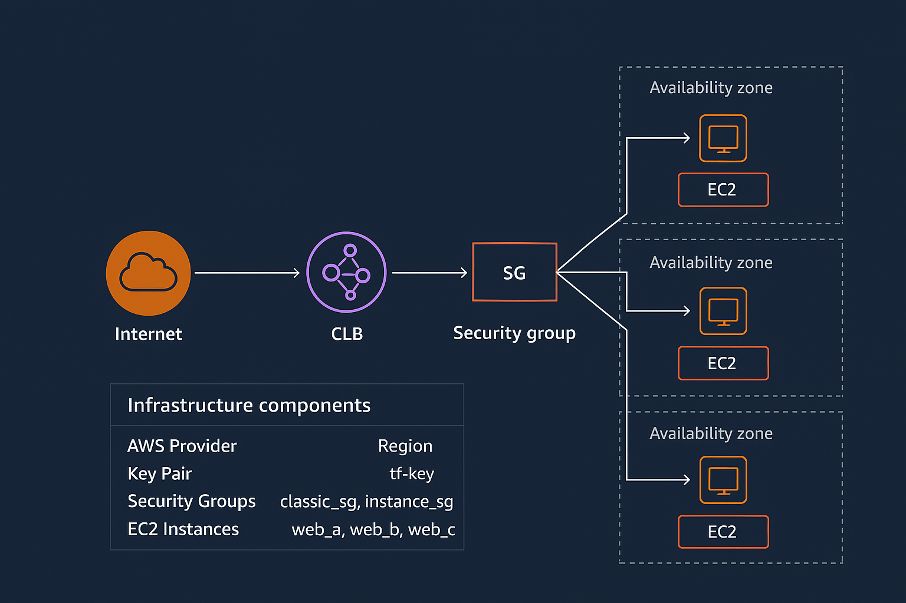
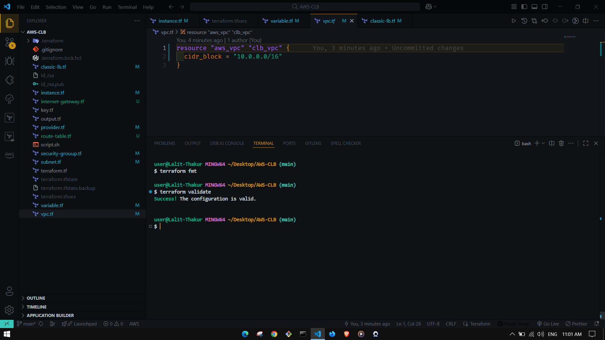
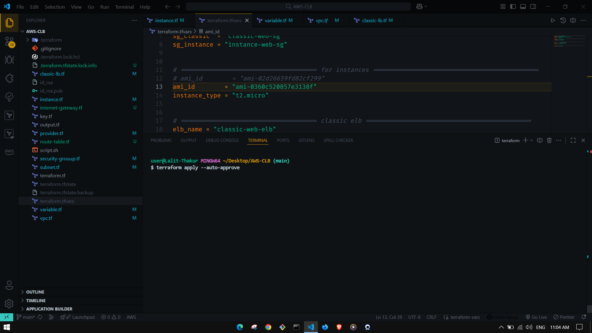
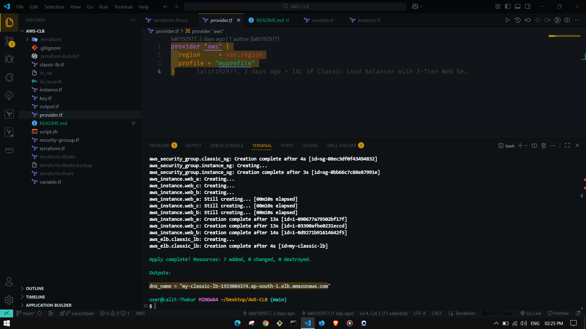
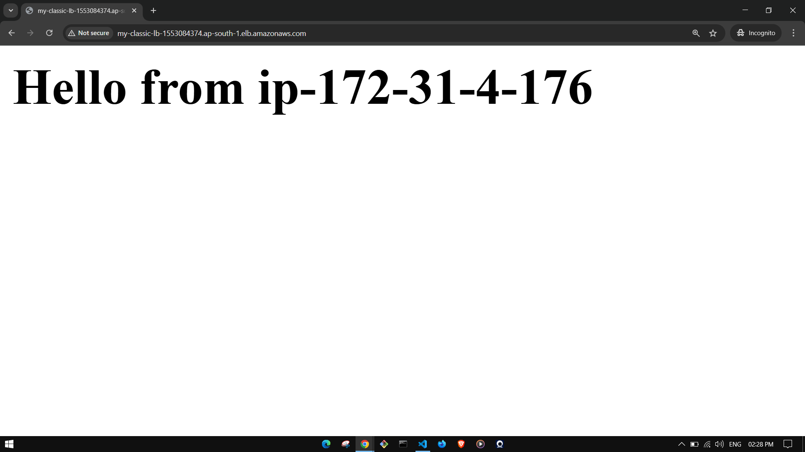
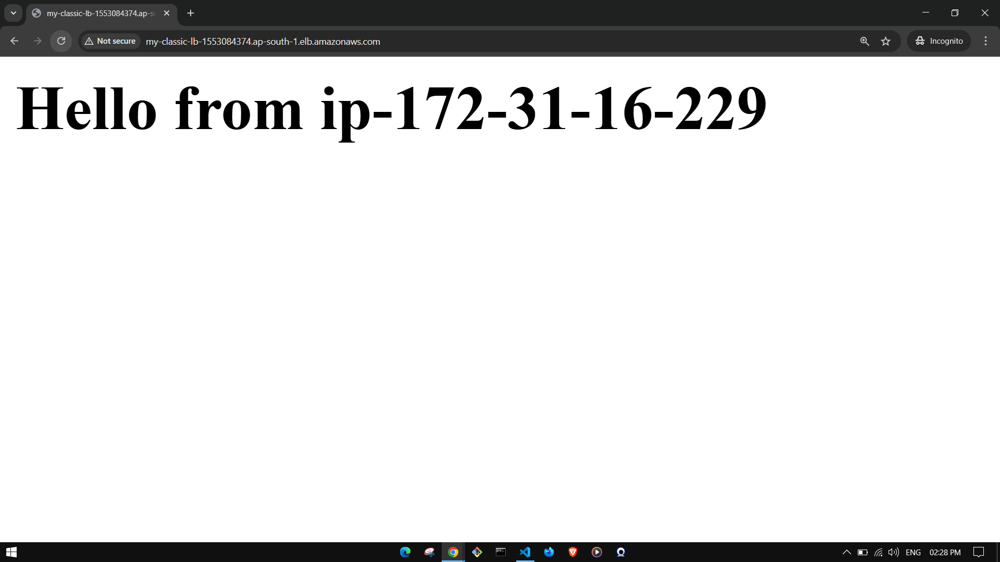

## 📸 Project Screenshots & Architecture









---
# AWS Classic Load Balancer Setup using Terraform

## 📌 Project Overview
This project provisions an AWS infrastructure using **Terraform** where a **Classic Load Balancer (CLB)** distributes HTTP traffic across three EC2 instances running in different Availability Zones within the **ap-south-1 (Mumbai)** region.  
Each EC2 instance runs **Nginx** as a web server with a simple test page to verify load balancing.

---

## ⚙️ Infrastructure Components
- **AWS Provider** → Configured with custom profile (`myprofile`) and region (`ap-south-1`).
- **Key Pair** → SSH key for accessing EC2 instances (`tf-key`).
- **Security Groups**:
  - `classic_sg` → Allows inbound HTTP (80) from anywhere.
  - `instance_sg` → Allows HTTP & SSH only from the Load Balancer SG.
- **EC2 Instances**:
  - `web_a`, `web_b`, `web_c` → each deployed in a separate Availability Zone.
  - Uses `script.sh` to install and configure **Nginx** with a test page.
- **Classic Load Balancer (CLB)**:
  - Distributes traffic across all 3 EC2 instances.
  - Performs health checks on port 80.
- **Outputs**:
  - Prints the **CLB DNS name** after deployment.

---

## 📂 Project Structure
├── classic-lb.tf # Classic Load Balancer definition
├── instance.tf # EC2 instances (web_a, web_b, web_c)
├── key.tf # Key Pair for SSH access
├── output.tf # Terraform outputs (CLB DNS name)
├── provider.tf # AWS provider configuration
├── script.sh # User data script (Nginx + test page)
├── security-group.tf # Security groups for LB & instances
├── terraform.tf # Terraform provider requirements
├── terraform.tfvars # Variable values
├── variable.tf # Variable definitions
├── .gitignore # Ignore Terraform state & sensitive files


---

## 🛠 Prerequisites
- [Terraform](https://developer.hashicorp.com/terraform/downloads) (v1.3+ recommended)
- [AWS CLI](https://aws.amazon.com/cli/) configured with a profile (`myprofile`)
- IAM User with sufficient permissions (`EC2`, `ELB`, `VPC`, `Security Groups`, `Key Pairs`)
- SSH key pair generated locally (`id_rsa`, `id_rsa.pub`)

---

## 🚀 How to Deploy

1. **Clone the repository**
```bash
   git clone <https://github.com/lalit192977/AWS-CLB-Terraform.git>
   cd <AWS-CLB-Terraform>
```
2. **initialize terraform**
```bash
        terrafor init
```
3. **Validate the configuration**
```bash
terraform validate
```
4. **Preview the execution plan**
```bash
terraform plan
```
5. **Apply the configuration**
```bash
terraform apply -auto-approve
```
6. **Get the Load Balancer DNS**
```bash
terraform output dns_name
```

---
## ✅ Verification

Copy the DNS name output (something like my-classic-lb-123456.ap-south-1.elb.amazonaws.com).

Open it in a browser → You should see:

Hello from host1<ip>
Hello from host2<ip>
Hello from host3<ip>

Hello from web-c
(on page refresh, traffic is distributed across different EC2 instances).

---
## 🧹 Cleanup
To avoid AWS costs, destroy the infrastructure when not needed:
```bash
terraform destroy -auto-approve
```
---
## 📌 Notes

CLB is a legacy load balancer (AWS recommends using ALB/NLB for new deployments).

This project is for learning and demo purposes.

Security Groups are configured for restricted access (only LB can talk to EC2s).